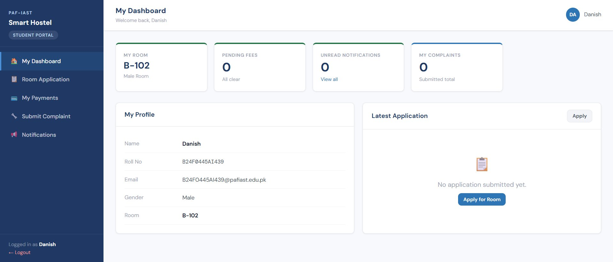
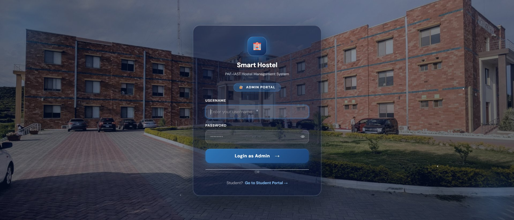
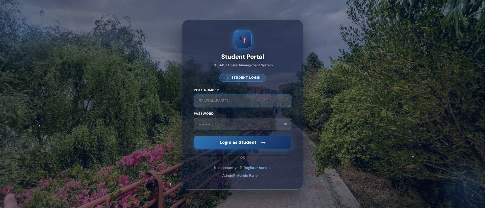
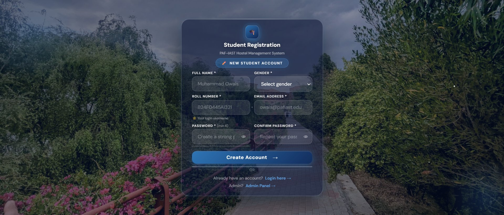
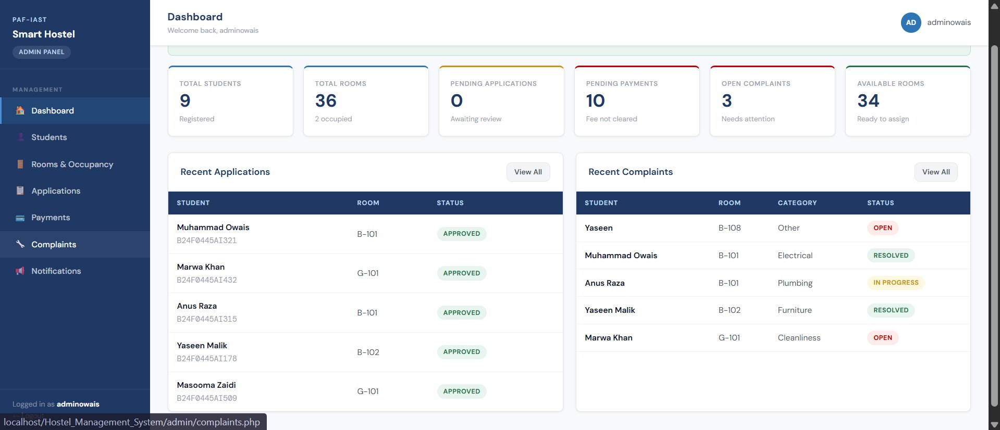
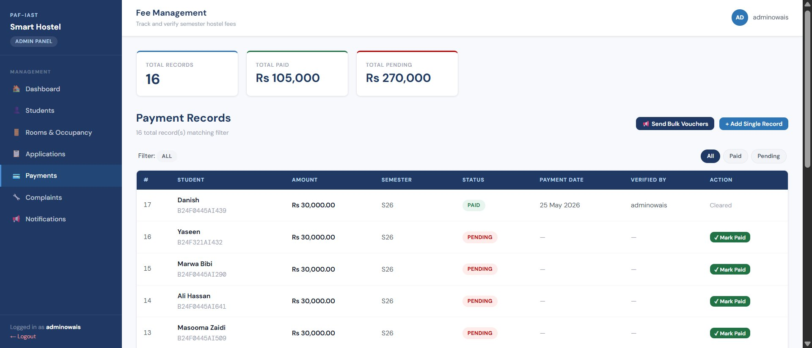
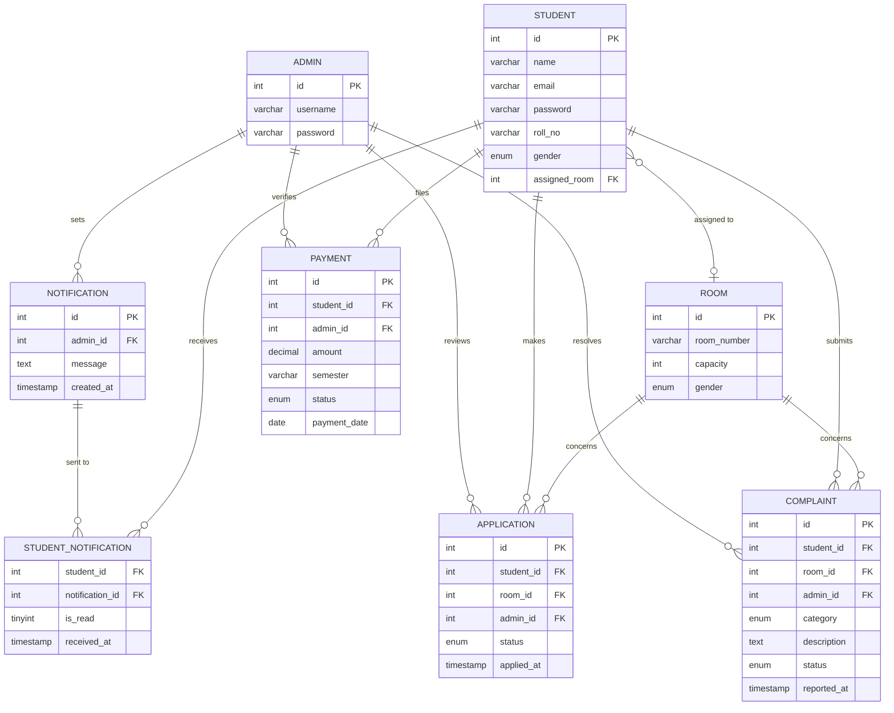

<h1 align="center">🏨 Smart Hostel Management System</h1>

<p align="center">
  A full-stack web application for managing hostel operations built with <strong>PHP 8</strong>, <strong>MySQL</strong>, and <strong>PDO</strong>.
  <br/>
  Supports dual-role access (Admin & Student), room allocation with gender-matching, fee tracking, complaint management, and real-time notifications.
</p>

<p align="center">
  
  
  
  
  
</p>

---

## 📸 Screenshots

### 🔐 Login & Registration
| Admin Login | Student Login | Student Registration |
|:-----------:|:-------------:|:--------------------:|
|  |  |  |

### 👨‍💼 Admin Panel
| Dashboard | Student Management |
|:---------:|:-----------------:|
|  |  |

| Rooms & Occupancy | Fee Management |
|:-----------------:|:--------------:|
|  |  |

| Complaints |
|:----------:|
|  |

### 🎓 Student Portal
| Student Dashboard | My Payments |
|:-----------------:|:-----------:|
|  |  |

---

## ✨ Features

### 👨‍💼 Admin Panel
- **Dashboard** — Live stats: total students, rooms occupied, pending applications, pending fees, open complaints, available rooms
- **Student Management** — Register students, assign rooms with server-side gender-match enforcement, search by name/roll no/email
- **Rooms & Occupancy** — Visual fill-percentage bars, real-time occupancy derived from a SQL VIEW (no manual flags)
- **Application Review** — Approve or reject room applications using atomic DB transactions with full rollback on failure
- **Fee Management** — Track semester payments, mark paid, send bulk vouchers, view total paid vs pending
- **Complaint Resolution** — View, filter (Open / In Progress / Resolved), and update maintenance complaints
- **Notifications** — Broadcast announcements to all students instantly with read-receipt tracking

### 🎓 Student Portal
- **Dashboard** — Room status, pending fees, unread notifications, complaint count, profile overview
- **Room Application** — Apply for available rooms filtered by gender; blocked if already assigned
- **My Payments** — View semester fee records, payment date, and verified-by details
- **Submit Complaint** — Report maintenance issues by category (Electrical, Plumbing, Furniture, Cleanliness, Other)
- **Notifications** — Receive and read announcements from admin

---

## 🛠️ Tech Stack

| Layer      | Technology                                          |
|------------|-----------------------------------------------------|
| Backend    | PHP 8.x, PDO with prepared statements               |
| Database   | MySQL 8.0 — 8 tables + 1 derived `room_occupancy` VIEW |
| Frontend   | Vanilla CSS, Google Fonts (DM Sans), no frameworks  |
| Auth       | PHP Sessions, `password_hash()` / `password_verify()` (bcrypt) |
| Server     | Apache via XAMPP or WAMP                            |

---

## 🗂️ Project Structure

```
Hostel_Management_System/
├── admin/
│   ├── dashboard.php          # Live stats + recent applications & complaints
│   ├── students.php           # Student list, registration, room assignment
│   ├── rooms.php              # Read-only occupancy derived from VIEW
│   ├── applications.php       # Approve/reject with atomic transactions
│   ├── payments.php           # Payment tracking + bulk vouchers
│   ├── complaints.php         # Complaint resolution with status filter
│   ├── notifications.php      # Broadcast with read-receipt tracking
│   ├── login.php              # Admin authentication
│   └── logout.php
├── student/
│   ├── dashboard.php          # Student overview + profile
│   ├── register.php           # Self-registration form
│   ├── application.php        # Gender-filtered room application
│   ├── payment.php            # Fee history
│   ├── complaint.php          # Submit & track complaints
│   ├── notifications.php      # Notification inbox
│   ├── login.php              # Student authentication (Roll No + password)
│   └── logout.php
├── includes/
│   ├── db.php                 # PDO singleton — configure DB credentials here
│   ├── auth.php               # Role-based session guards (requireAdmin / requireStudent)
│   ├── layout.php             # Shared UI: sidebar, topbar, flash messages, page helpers
│   └── style.css              # Global stylesheet with CSS variables
├── screenshots/               # README screenshots
├── hostel_db.sql              # Full DB schema + seed data
└── index.php                  # Entry point — redirects to appropriate login
```

---

## ⚙️ Setup & Installation

### Prerequisites
- [XAMPP](https://www.apachefriends.org/) or WAMP installed
- PHP 8.0+
- MySQL 8.0+

### Steps

**1. Place the project in your web server root**
```
htdocs/Hostel_Management_System/    ← XAMPP
www/Hostel_Management_System/       ← WAMP
```

**2. Import the database**
- Open **phpMyAdmin** → Import → select `hostel_db.sql` → Go
- The SQL file will auto-create the `hostel_db` database and all tables

**3. Configure the database connection**

Open `includes/db.php` and update your credentials:
```php
define('DB_USER', 'root');    // your MySQL username
define('DB_PASS', '');        // your MySQL password (leave empty if none)
```
> `DB_HOST` and `DB_NAME` don't need to change.

**4. Start Apache + MySQL** from the XAMPP/WAMP Control Panel

**5. Open the app in your browser**
```
http://localhost/Hostel_Management_System/
```

---

## 🔐 Login

> ⚠️ **Never commit real credentials to a public repository.**
> Set your own credentials in `hostel_db.sql` before importing, and update them via the admin panel after setup.

| Role    | URL                        | Username field |
|---------|----------------------------|----------------|
| Admin   | `/admin/login.php`         | Username       |
| Student | `/student/login.php`       | Roll Number    |

---

## 🧱 Database Design Highlights

- **`room_occupancy` VIEW** — Derives `is_occupied`, `current_occupants`, and `available_slots` dynamically by counting assigned students. PHP never manually sets occupancy — single source of truth.
- **Atomic Transactions** — Room application approvals use `PDO::beginTransaction()` to update both `applications` and `students` together, with automatic rollback on any failure.
- **Gender-Match Enforcement** — Applied at three independent layers: SQL `WHERE` filter, JavaScript dropdown filter, and PHP server-side guard.
- **Bcrypt Passwords** — All passwords stored using `PASSWORD_BCRYPT` via `password_hash()`. No plain-text passwords anywhere.
- **Cascade Deletes** — Foreign keys on `students`, `notifications`, and `applications` use `ON DELETE CASCADE` to keep data consistent automatically.

---

## 🗄️ Entity Relationship Diagram (ERD)



---

## 👥 Authors

This project was built as a **4th Semester Database course project** by students of **BS Artificial Intelligence** at PAF-IAST.

| Name                  | Role           |
|-----------------------|----------------|
| Muhammad Owais Arshad | Lead Developer |
| Ehtisham ul Haq       | Contributor    |
| Marwa Noor            | Contributor    |

---

## 🙏 Acknowledgement

We would like to express our sincere gratitude to our Database course instructor **Dr. Musadaq Mansoor** for his guidance, support, and valuable feedback throughout this project. His teaching gave us the foundation to design and implement a relational database system from scratch.

---

## 📄 License

This project was developed as an academic submission at **PAF-IAST**. Feel free to use or extend it for educational purposes.
